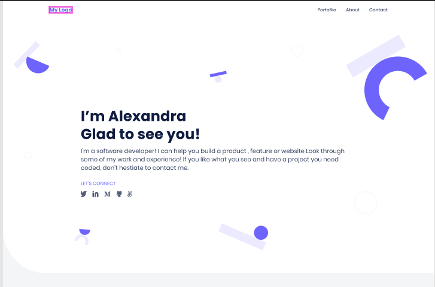
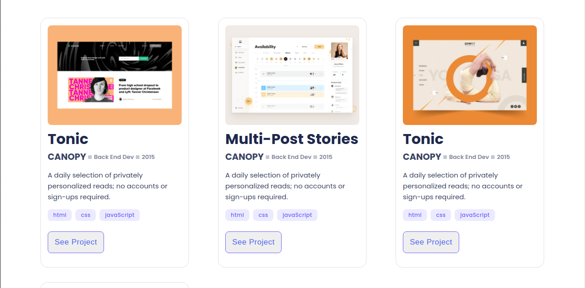
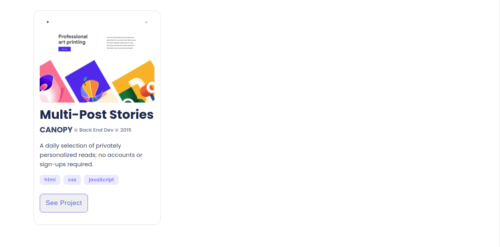
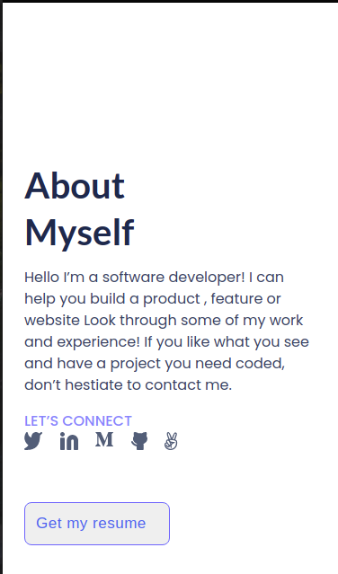
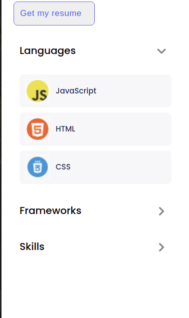

# Personal Portfolio

> In this project, I will create a personal portfolio. A portfolio website is a key job searching tool for a web developer. In this project, I will precisely replicate one of the *portfolio templates* from Microverse Figma. 




 

This project is part of the Microverse curriculum. The main objective is to understand how to parse a Figma design and follow professional guidlines in responsive design.


## Built With

- Html/Css

## Additional Tools

- Figma
- stylelint

## Getting Started

To get a local copy of this project:

Clone this repository or download the Zip folder:
```
git clone git@github.com:KDlamini/portfolio-website.git
```

## Authors

👤 **Simo Nkosi**

- GitHub: [@githubhandle](https://github.com/KDlamini)
- Twitter: [@twitterhandle](https://twitter.com/RealSimoNkosi)
- LinkedIn: [LinkedIn](https://www.linkedin.com/in/simo-nkosi-418523180/)


## 🤝 Contributing

Contributions, issues, and feature requests are welcome!  
Feel free to check the [issues page](https://github.com/KDlamini/portfolio-website/issues).


## Show your support

Give a ⭐️ if you like this project!

## Acknowledgments

- This project is part of day 4 of module 1 in the Microverse study program.

## 📝 License

This project is [MIT](./MIT.md) licensed.
